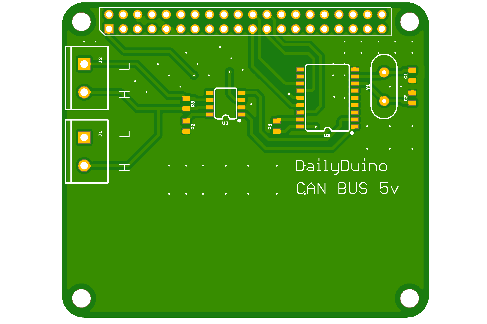

# Raspberry Pi-CAN Bus Hat PCB Gerber
Free to use Raspberry Pi CAN bus hat pcb gerber files

<b> BOM </b>

<table>

<tr>
  <th> Part </th>
  <th> Value </th>
  <th> Package </th>
</tr>

<tr>
  <td> R1,R2 </td>
  <td> 10k</td>
  <td> 0805 </td>
</tr>

<tr>
  <td> R3 </td>
  <td> 120R</td>
  <td> 0805 </td>
</tr>

<tr>
  <td> C1,C2 </td>
  <td> 22pF</td>
  <td> 0805 </td>
</tr>

<tr>
  <td> Y1 </td>
  <td> 16Mhz</td>
  <td> HC49US </td>
</tr>

<tr>
  <td> U2 </td>
  <td> MCP2515</td>
  <td> SO-18 </td>
</tr>

<tr>
  <td> U2 </td>
  <td> MCP2551</td>
  <td> SO-8 </td>
</tr>

<tr>
  <td> J1,J2 </td>
  <td> Terminal Block</td>
  <td> 5mm</td>
</tr>
</table>

# For more information please visit https://dailyduino.com/
